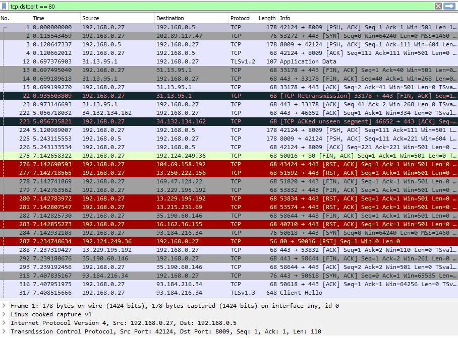
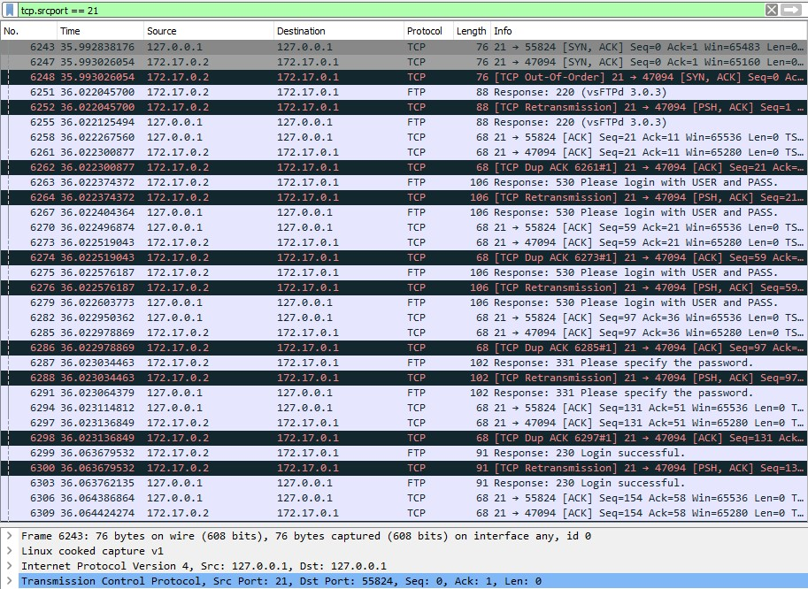
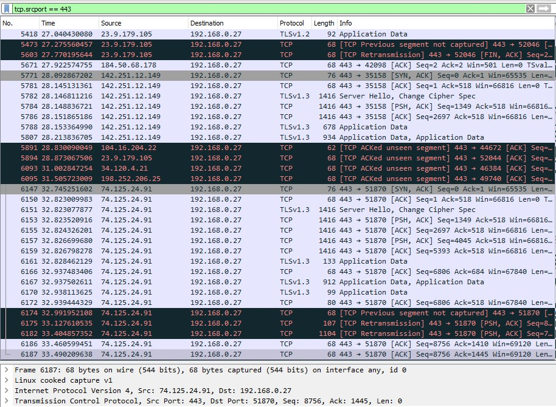
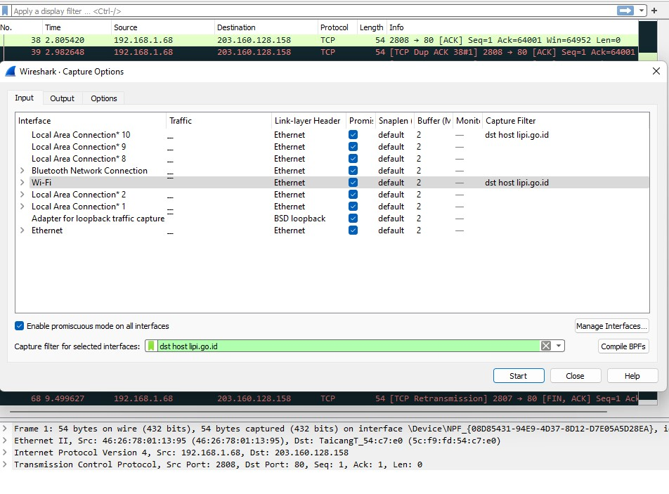
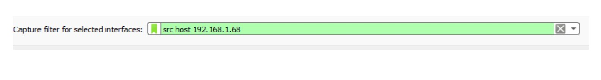
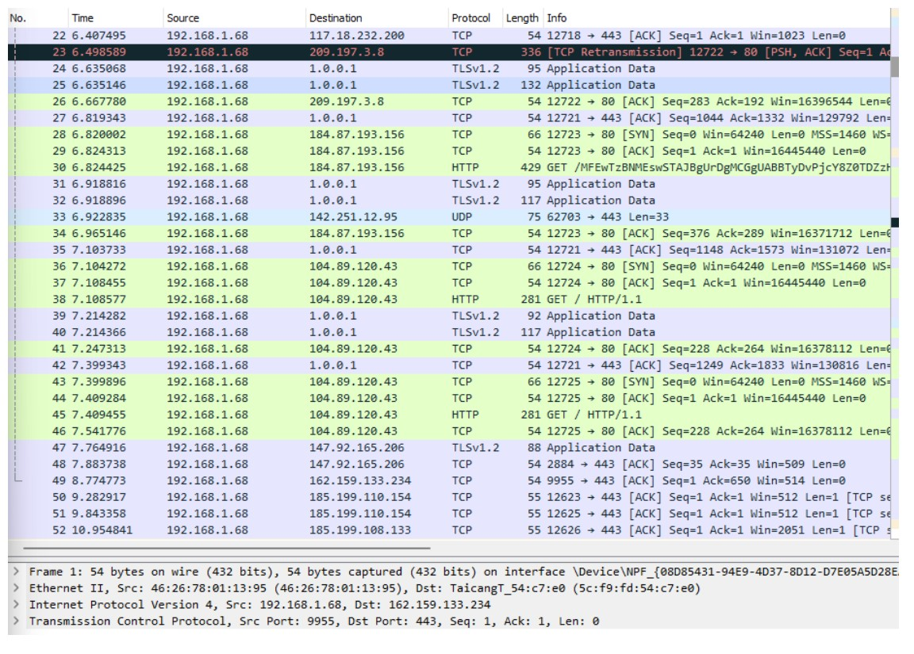

# Jarkom-Modul-1-D07-2022

### Kelompok D03

| **No** | **Nama**                     | **NRP**    |
| ------ | -----------------------------| ---------- |
| 1      | Reza Maranello Alfiansyah    | 5025201071 |
| 2      | Nuzul Abatony                | 5025201107 |
| 3      | Muhammad Raihan Athallah     | 5025201206 |

### Kendala
<ol>
    <li> no 8-10 saya kira salted itu bukan file tapi semacam key
    <li> 
</ol>

# Pembahasan
**Nomor 1**:  Sebutkan web server yang digunakan pada "monta.if.its.ac.id"! 

**Jawab**: 
<ol>
    <li>Gunakan filter pada packet capture berupa “tcp contains monta” lalu pilih salah satu packet tcp untuk dilakukan follow tcp stream, kemudian akan ditampilkan webserver yang digunakan. Dalam kasus ini, webserver yang digunakan adalah nginx/1.10.3
</ol>
(img/1.jpg)

**Nomor 2**:  
Ishaq sedang bingung mencari topik ta untuk semester ini , lalu ia datang ke website monta dan menemukan **detail topik** pada website “monta.if.its.ac.id” , judul TA apa yang dibuka oleh ishaq?

**Jawab**:  
<ol>
    <li>Buka file pcapng yang diberikan lalu apply filter http pada column protocol kemudian cari packet yang memuat JUDUL TA bukan, sehingga dalam kasus ini ditemukan judul berupa Perancangan Sistem Pengendali Panas Otomatis pada Mesin Sangrai Kopi dengan Logika Fuzzy
</ol>
(img/2_1.jpg)
(img/2_2.jpg)
(img/2_3.jpg)
(img/2_4.jpg)

**Nomor 3**: 
Filter sehingga wireshark hanya menampilkan paket yang menuju port 80!

**Jawab**:  
<ol>
    <li> Menggunakan display filter tcp.dstport == 80 maka akan mengfilter paket-paket yang hanya menuju ke port 80
</ol>

**Nomor 4**: 
Filter sehingga wireshark hanya mengambil paket yang berasal dari port 21! 

**Jawab**:  
<ol>
    <li> Menggunakan display filter tcp.srcport == 21 maka akan mengfilter paket-paket yang hanya berasal dari port 21
</ol>

**Nomor 5**:  
Filter sehingga wireshark hanya mengambil paket yang berasal dari port 443!

**Jawab**:  
<ol>
    <li> Menggunakan display filter tcp.srcport == 443 maka akan mengfilter paket-paket yang hanya berasal dari port 443
</ol>

**Nomor 6**:  
Filter sehingga wireshark hanya menampilkan paket yang menuju ke lipi.go.id !

**Jawab**:  
<ol>
    <li> Menggunakan capture filter dst host lipi.go.id untuk mendapatkan paket-paket yang menuju lipi.go.id
</ol>

**Nomor 7**:  
Filter sehingga wireshark hanya mengambil paket yang berasal dari ip kalian!

**Jawab**:  
<ol>
    <li> Menggunakan capture filter src host 192.68.1.68 untuk mengcapture paket yang berasal dari ip saya
</ol>

 ⚠️ **Untuk soal 8-10, silahkan baca cerita di bawah ini!**  ⚠️

>Di sebuah planet bernama Viltrumite, terdapat Kementerian Komunikasi dan Informatika yang baru saja menetapkan kebijakan baru. Dalam kebijakan baru tersebut, pemerintah dapat mengakses data pribadi masyarakat secara bebas jika memang dibutuhkan, baik dengan maupun tanpa persetujuan pihak yang bersangkutan. Sebagai mahasiswa yang sedang melaksanakan program magang di kementerian tersebut, kalian mendapat tugas berupa penyadapan percakapan mahasiswa yang diduga melakukan tindak kecurangan dalam kegiatan Praktikum Komunikasi Data dan Jaringan Komputer 2022. Selain itu, terdapat sebuah password rahasia (flag) yang diduga merupakan milik sebuah organisasi bawah tanah yang selama ini tidak sejalan dengan pemerintahan Planet Viltrumite. Tunggu apa lagi, segera kerjakan tugas magang tersebut agar kalian bisa mendapatkan pujian serta kenaikan jabatan di kementerian tersebut!

**Nomor 8**:  
Telusuri aliran paket dalam file .pcap yang diberikan, cari informasi berguna berupa percakapan antara dua mahasiswa terkait tindakan kecurangan pada kegiatan praktikum. Percakapan tersebut dilaporkan menggunakan protokol jaringan dengan tingkat keandalan yang tinggi dalam pertukaran datanya sehingga kalian perlu menerapkan filter dengan protokol yang tersebut.

**Jawab**:  
<ol>
    <li> berdasarkan <i>"Percakapan tersebut dilaporkan menggunakan protokol jaringan dengan tingkat keandalan yang tinggi"</i>
    <li> filter packet TCP yang mengugnakan mekanisme ACK dengan <code>tcp.flag.ack == 1</code> 
    <li> dari paket-paket yang ditemuan, kita bisa memfollow percakapan paket tersebut dengan <code>follow tcp stream (ctrl+alt+shift+t)</code> kemudian memfilter stream tersebut
    <li> ulangi langkah 3 sampai dapat semua percakapan yang relevan
</ol>

**Nomor 9**:  
Terdapat laporan adanya pertukaran file yang dilakukan oleh kedua mahasiswa dalam percakapan yang diperoleh, carilah file yang dimaksud! Untuk memudahkan laporan kepada atasan, beri nama file yang ditemukan dengan format [nama_kelompok].des3 dan simpan output file dengan nama “flag.txt”.

**Jawab**:  
<ol>
    <li> berdasarkan percakapan yang didapatkan di nomor 8, diketahui bahwa file salt dikirim di <code>port 9002</code> dan perlu didecrypt dengan passowrd <i>"nakano"</i>.
    <li> filter packet TCP yang dikirim di port 9002 dengan <code>tcp.port == 9002</code>
    <li> follow tcp stream hingga ditemukan file salted
    <li> setelah file salt ditemukan, copy hexdump ke dalam sebuah file (ex: input.txt)
    <li> convert hexdump ke binary dalam bentuk file .des3 dengan <code>xxd xxd -r -p input.txt d07.des3</code>
    <li> decrypt d07.des3 ke .txt dengan openssl, dengan kode <code>openssl des3 -d -salt -in d07.des3 -out flag.txt -k nakano</code>
</ol>

**Nomor 10**:  
Temukan password rahasia (flag) dari organisasi bawah tanah yang disebutkan di atas!

**Jawab**:  
<ol>
    <li> buka file flag.txt
    <li> didapatkan flag <code>JaRkOm2022{8uK4N_CtF_k0k_h3h3h3}</code>
</ol>
